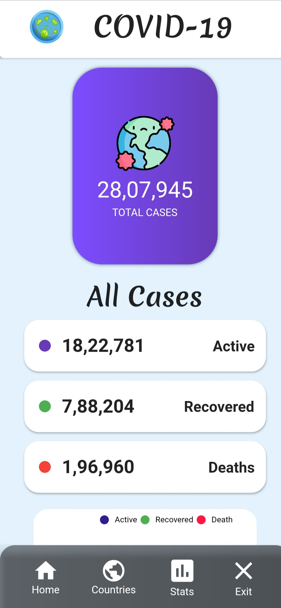
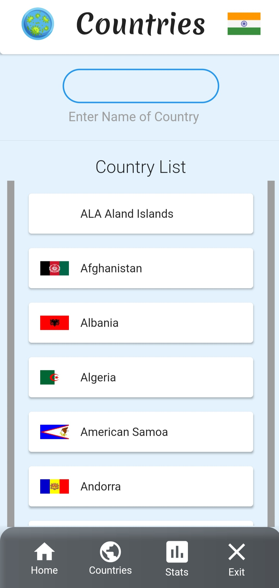
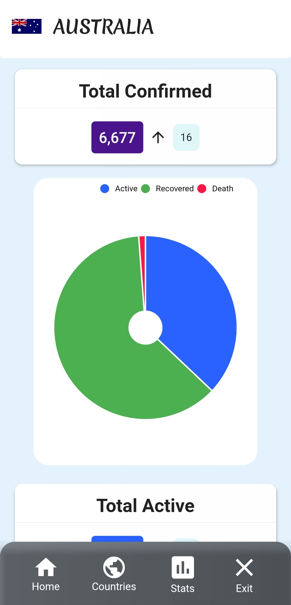
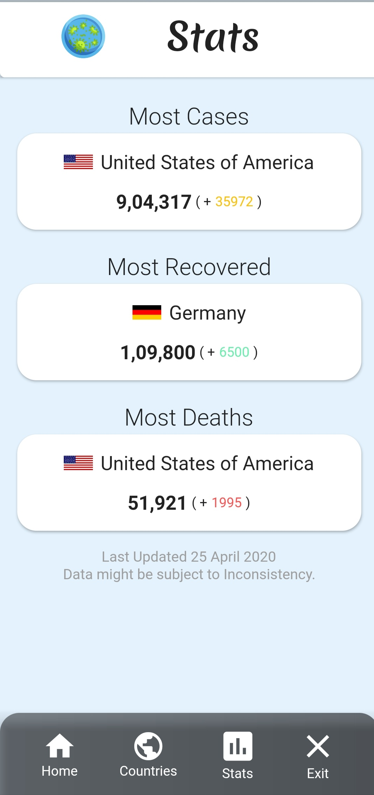

# Covid-19 Track 

  
Covid-19 Track is free and Open Source, Cross Platform Application developed using [Flutter](https://github.com/flutter/flutter).
Download the Latest version from the below links.

## Download the App

### Direct Download

### MediaFire

## About

Covid-19 Track tracks the active, recovered and deaths due to corona virus all over the world and updates daily.  
This Mobile application allows you to select different countries to obtain the results seperately with graphical visualisations.

## Features

### The android app lets you:

- View the total cases, and all the active ,recovered, deaths and all the details about the new cases with chart representations in the   home screen.
- Select countries specifically for their specific details with chart representaions.
- Completely ad-free.
- View the total statistic details on countries with Most Cases, Most Recovered and Most Deaths.
- Gets updated regularly.
- Has a minimal user interface.
- View Detailed information on all the states and Districts in India.
- Information on symptoms and prevention of Covid-19

## Screenshots

### Home Screen

    
### Select Country

    
 ### Statistics
 

## Permissions

On Android versions prior to Android 6.0, Covid-19 Track requires the following permissions:
- Full Network Access.
- View Network Connections.

It uses the network data to update the app contents regularly and provide the latest information on all countries with updated visual representation.
No use of data in background.

## Contributing

Covid-19 Track app is a free and open source project. Any contributions are welcome. Here are a few ways you can help:
 * [Report bugs and make suggestions.](https://github.com/adarshbalu/covid_track/issues)
 * [Open a pull Request](https://github.com/adarshbalu/covid_track/pulls)
 

## Credits  
- Thanks [COVID-19 API](https://covid19api.com/) for country data.
- Thanks [COVID19-India API](https://api.covid19india.org/) for India data.
- Thanks Wanicon (https://flaticon.com/authors/wanicon) for the app icon.
- Thanks Freepik (https://flaticon.com/authors/freepik) for icons.
- Thanks [Rendi Ramadana](https://www.uplabs.com/posts/coronavirus-information-concept) for UI design.
- Thanks [Preethi](https://github.com/preethirkrish) for help in documentation and UI design .

## License

This application is released under GNU GPLv3 (see [LICENSE](LICENSE)).
Some of the used libraries are released under different licenses.
